# DH-89 Rapide Liveries
##FlightGear Liveries (Hi-Res)

These are updated and new 4096x4096 Liveries for Helijah's DH-89 Rapide (Available in sim)

Extract the contents of each zip file into your "***\Aircraft\DH-89\Models\Liveries" directory.

NR782 - Royal Navy
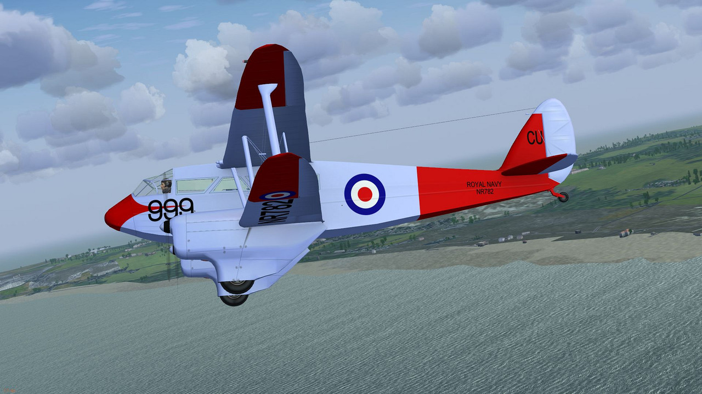

1 Trans Va - Domine
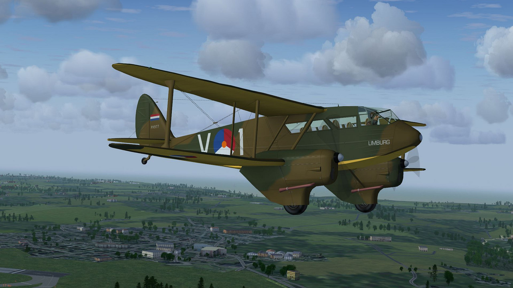

G-ADDE - Allied Airways
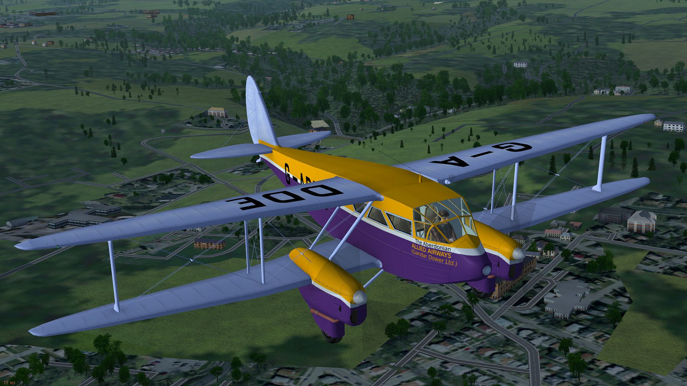

G-ADAL - Hillman Airways
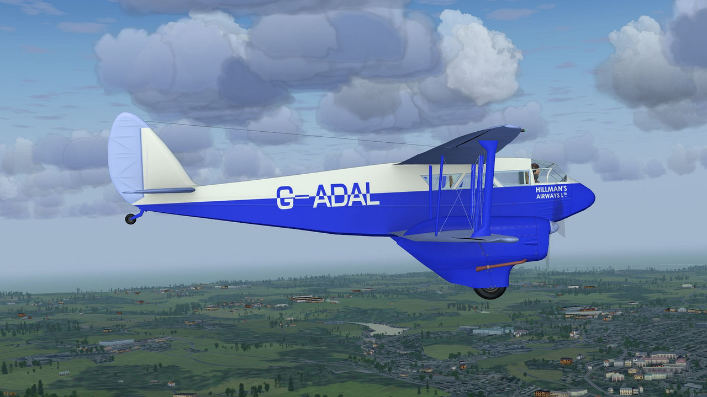

G-ADDD - King's Flight
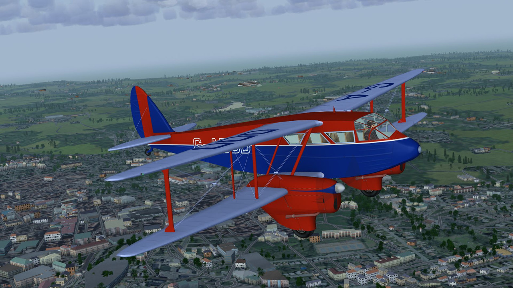

X7386 - RAF No.2 Radio School
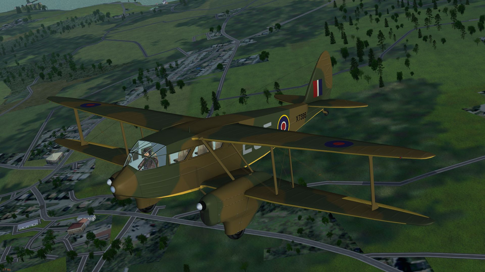

ZK-ACO
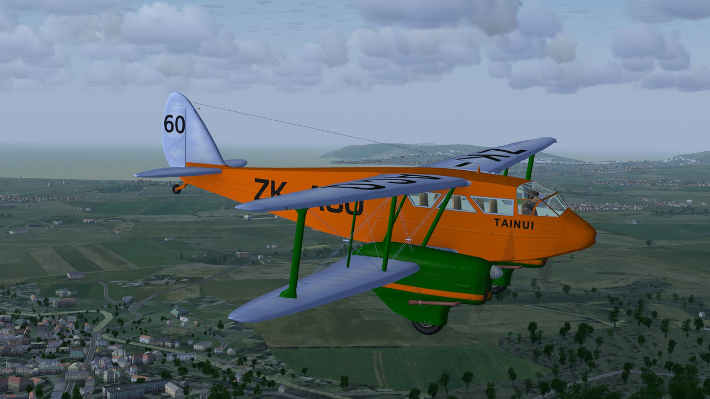

G-AGSJ - Island Air Services
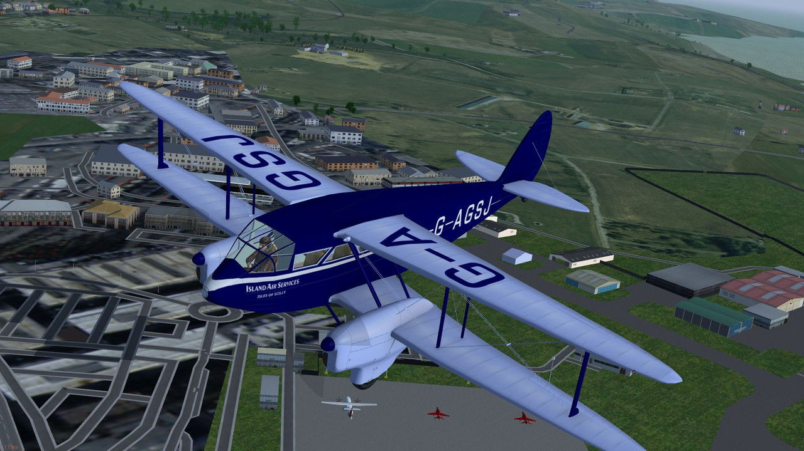

G-AGSH

YR-DRI - LARES
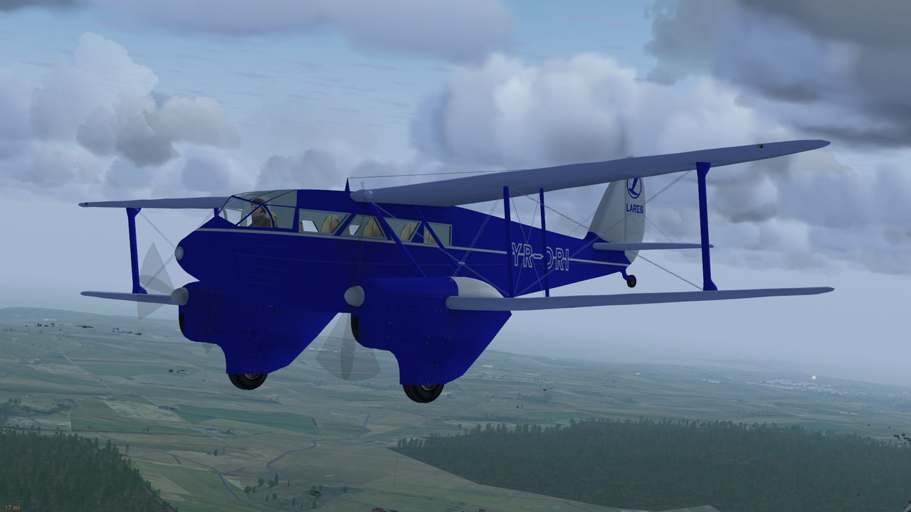

G-AGZO - Marshall Cambridge
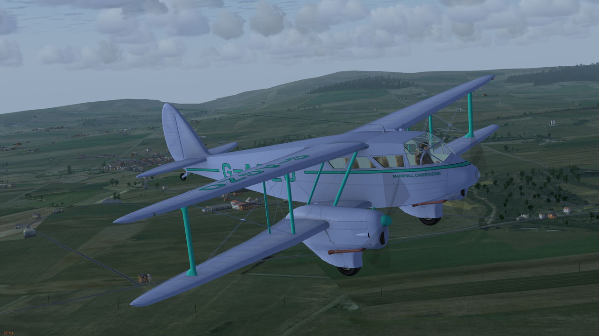

G-AIBB - Luton Airways
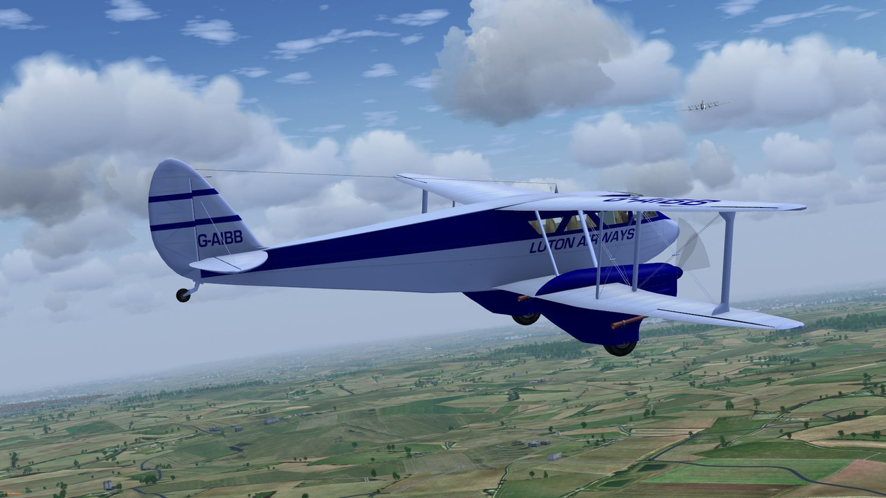

ZK-SWR - Swissair
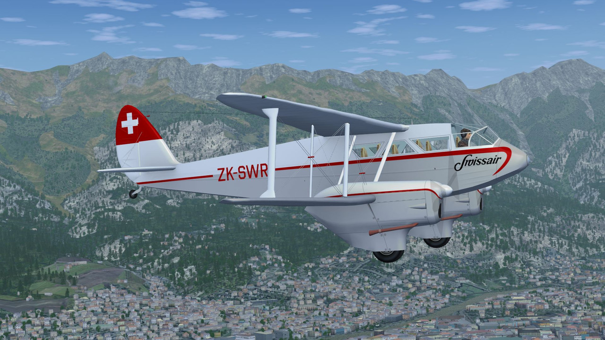

G-AHKV - Automobile Association
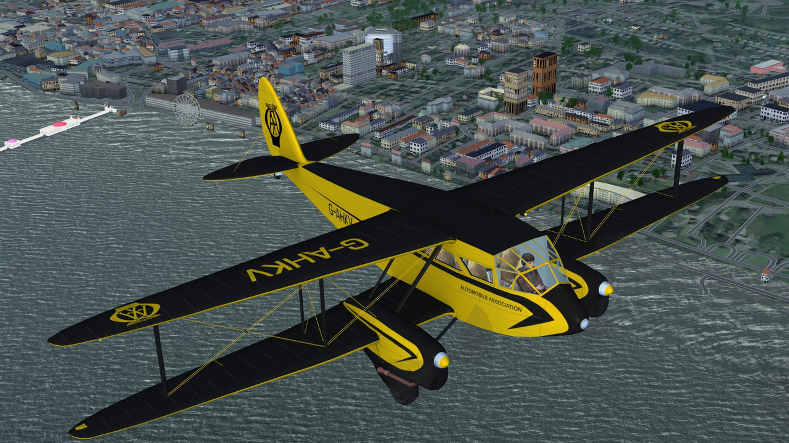

G-AHLF
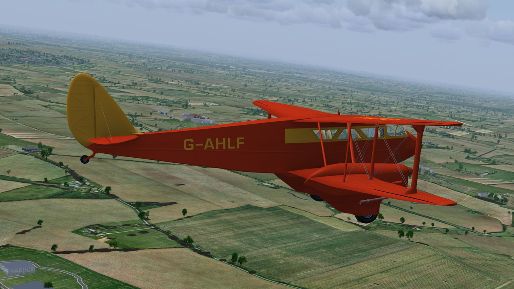

